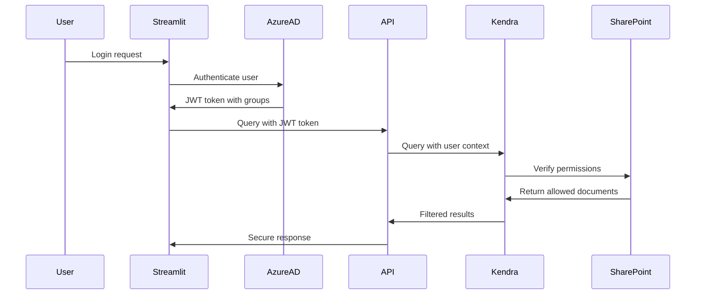

# SharePoint Integration - Unified Bedrock Knowledge Base with V2 Connector

This guide explains how to integrate SharePoint Online content into your unified Bedrock Knowledge Base using Kendra SharePoint Connector V2 for enhanced ACL-based access control.

## 🔐 How Unified SharePoint Integration Works

### SharePoint V2 ACL-to-Metadata Conversion Process

1. **V2 Enhanced ACL Discovery**: Kendra's SharePoint Connector V2 scans SharePoint permissions with granular detail
2. **Advanced Permission Mapping**: V2 captures permission levels, inheritance, and principal types
3. **ACL-to-Metadata Conversion**: Sync Lambda converts SharePoint ACLs to Bedrock metadata format
4. **Unified Knowledge Base**: SharePoint content joins PDFs in single Bedrock Knowledge Base
5. **Consistent Filtering**: Same metadata filtering applies to both PDFs and SharePoint content

### V2 Enhanced ACL Data Structure

When Kendra SharePoint Connector V2 indexes SharePoint content, it captures enhanced ACL data:

```json
{
  "document_id": "sharepoint_page_123",
  "content": "Page content here...",
  "sharepoint_acl_v2": [
    {
      "principal": "john.doe@company.com",
      "type": "user",
      "permissions": ["read", "contribute", "full_control"],
      "access": "allow",
      "inheritance": "inherited"
    },
    {
      "principal": "Finance Team",
      "type": "group",
      "permissions": ["read", "contribute"],
      "access": "allow",
      "inheritance": "direct"
    }
  ],
  "metadata": {
    "sharepoint_site_url": "https://company.sharepoint.com/sites/finance",
    "sharepoint_content_type": "Site Page",
    "sharepoint_author": "john.doe@company.com",
    "sharepoint_created": "2024-01-15T10:30:00.123Z",
    "sharepoint_modified": "2024-01-20T14:45:30.456Z"
  }
}
```

### Unified Architecture Flow

1. **Kendra V2 Connector** → Captures enhanced SharePoint ACLs
2. **SharePoint Sync Lambda** → Converts ACLs to Bedrock metadata
3. **S3 Upload** → SharePoint content stored with metadata
4. **Bedrock Ingestion** → Content indexed in unified knowledge base
5. **Single API Query** → Both PDFs and SharePoint content searchable

## 🚀 Setup Instructions

### Step 1: Configure SharePoint Credentials

After deployment, update the SharePoint credentials in AWS Secrets Manager:

```bash
# Update SharePoint credentials
aws secretsmanager update-secret \
  --secret-id "kendra-sharepoint-credentials-[suffix]" \
  --secret-string '{
    "username": "your-service-account@company.com",
    "password": "your-service-account-password",
    "domain": "company.onmicrosoft.com"
  }'
```

### Step 2: Configure JWT Signing Key

Set up the JWT signing key for user token validation:

```bash
# Update JWT signing key (get this from your Azure AD app registration)
aws secretsmanager update-secret \
  --secret-id "kendra-jwt-signing-key-[suffix]" \
  --secret-string '{
    "key": "-----BEGIN CERTIFICATE-----\nMIIC...your-jwt-signing-key...\n-----END CERTIFICATE-----"
  }'
```

### Step 3: Update SharePoint URLs

Modify the SharePoint URLs in your Terraform configuration:

```hcl
# In main.tf, update the sharepoint_urls
sharepoint_urls = [
  "https://yourcompany.sharepoint.com/sites/finance",
  "https://yourcompany.sharepoint.com/sites/hr", 
  "https://yourcompany.sharepoint.com/sites/legal",
  "https://yourcompany.sharepoint.com/sites/projects"
]
```

### Step 4: Azure AD App Registration

Create an Azure AD application for JWT token generation:

1. **Register Application** in Azure AD
2. **Configure API Permissions**:
   - Microsoft Graph: `User.Read`
   - Microsoft Graph: `Group.Read.All`
   - SharePoint: `Sites.Read.All`
3. **Generate Client Secret**
4. **Configure Token Endpoint**

## 🔍 How ACL Filtering Works in Practice

### Scenario 1: User with Direct Access

```python
# User john.doe@company.com queries unified knowledge base for financial data
query_request = {
    "query": "What are the Q4 revenue numbers?",
    "user_id": "john.doe@company.com",
    "user_groups": ["Finance Team", "Executives"],
    "type": "retrieve_and_generate",
    "use_caching": True
}

# Unified Bedrock Knowledge Base automatically filters to return documents where:
# - john.doe@company.com is in access_users metadata, OR
# - "Finance Team" or "Executives" is in access_groups metadata
# - Applies to BOTH PDF documents AND SharePoint content
```

### Scenario 2: User with Group-Based Access

```python
# User jane.smith@company.com (member of HR Team) queries unified knowledge base
query_request = {
    "query": "What are the employee benefits?",
    "user_id": "jane.smith@company.com", 
    "user_groups": ["HR Team", "Managers"],
    "type": "retrieve_and_generate",
    "use_caching": True
}

# Returns both PDF documents and SharePoint pages where:
# - jane.smith@company.com has explicit access (access_users metadata), OR
# - "HR Team" or "Managers" group has access (access_groups metadata)
# - All results ranked together by relevance in single vector search
```

### Scenario 3: Unified Search (PDF + SharePoint in Single Knowledge Base)

```python
# Search unified knowledge base containing both PDFs and SharePoint content
query_request = {
    "query": "Show me all project documentation",
    "user_id": "project.manager@company.com",
    "user_groups": ["Project Managers", "Engineering"],
    "type": "retrieve_and_generate",
    "use_caching": True
}

# Single query returns:
# - PDF documents (source: pdf, filtered by metadata)
# - SharePoint pages (source: sharepoint, filtered by converted ACL metadata)
# - All content ranked together by relevance in single vector search
```

## 🛡️ Security Architecture

### Multi-Layer Access Control

1. **Network Layer**: VPC-only API Gateway
2. **Authentication Layer**: AWS IAM + JWT tokens
3. **Authorization Layer**: SharePoint ACLs + Metadata filtering
4. **Application Layer**: User/group-based result filtering

### Token Flow



## 📊 Usage Examples

### Unified Knowledge Base Search

```python
import requests
import json
from your_auth_module import get_user_jwt_token

def search_unified_knowledge_base(query, user_id, user_groups):
    """
    Search the unified Bedrock Knowledge Base containing both PDFs and SharePoint content.
    No need to specify sources - all content is in one knowledge base.
    """
    api_url = "https://[api-id].execute-api.us-east-1.amazonaws.com/prod/query"
    
    payload = {
        "query": query,
        "user_id": user_id,
        "user_groups": user_groups,
        "type": "retrieve_and_generate",
        "use_caching": True
    }
    
    # Make signed request (AWS IAM)
    response = make_signed_request(api_url, payload)
    return response.json()

# Example usage
result = search_unified_knowledge_base(
    query="What are the latest HR policies?",
    user_id="employee@company.com",
    user_groups=["All Employees", "HR Team"]
)

# Results include both PDFs and SharePoint content
print(f"Found {len(result['citations'])} relevant documents")
for citation in result['citations']:
    for ref in citation['retrievedReferences']:
        source = ref['metadata'].get('source', 'unknown')
        title = ref['metadata'].get('title', 'Untitled')
        
        if source == 'sharepoint':
            sharepoint_url = ref['metadata'].get('sharepoint_uri', '')
            print(f"- SharePoint: {title} ({sharepoint_url})")
        elif source == 'pdf':
            s3_location = ref['location'].get('s3Location', {}).get('uri', '')
            print(f"- PDF: {title} ({s3_location})")
```

### Advanced Search with Source Analysis

```python
def search_with_source_analysis(query, user_id, user_groups):
    """
    Search unified knowledge base and analyze results by source type.
    """
    payload = {
        "query": query,
        "user_id": user_id,
        "user_groups": user_groups,
        "type": "retrieve_and_generate",
        "use_caching": True
    }
    
    response = make_signed_request(api_url, payload)
    result = response.json()
    
    # Analyze source distribution from unified results
    pdf_results = []
    sharepoint_results = []
    
    for citation in result.get('citations', []):
        for ref in citation.get('retrievedReferences', []):
            source = ref.get('metadata', {}).get('source', 'unknown')
            if source == 'pdf':
                pdf_results.append(ref)
            elif source == 'sharepoint':
                sharepoint_results.append(ref)
    
    print(f"Unified search found:")
    print(f"- {len(pdf_results)} PDF documents")
    print(f"- {len(sharepoint_results)} SharePoint pages")
    print(f"- All ranked together by relevance")
    
    return result
```

## 🔧 Troubleshooting

### Common Issues

1. **No SharePoint Results Returned**
   - Check JWT token validity and user groups
   - Verify SharePoint connector sync status
   - Confirm user has actual SharePoint permissions

2. **Authentication Errors**
   - Validate JWT signing key in Secrets Manager
   - Check Azure AD app registration permissions
   - Verify token format and claims

3. **Sync Issues**
   - Monitor Kendra data source sync logs
   - Check SharePoint service account permissions
   - Verify network connectivity from VPC

### Monitoring Commands

```bash
# Check Kendra index status
aws kendra describe-index --index-id [kendra-index-id]

# Check data source sync status
aws kendra describe-data-source \
  --index-id [kendra-index-id] \
  --id [data-source-id]

# View sync history
aws kendra list-data-source-sync-jobs \
  --index-id [kendra-index-id] \
  --id [data-source-id]
```

## 💰 Cost Considerations

### Unified Architecture Costs
- **Kendra (ACL Capture Only)**: $810/month Developer Edition for SharePoint ACL extraction
- **Bedrock Knowledge Base**: Pay-per-query model for unified search
- **Lambda Sync Processing**: Minimal cost for daily SharePoint sync
- **S3 Storage**: Standard storage costs for SharePoint content
- **No Dual Query Costs**: Single knowledge base eliminates duplicate query charges

### Cost Optimization Benefits
- **Reduced Query Costs**: Single Bedrock query instead of dual Kendra+Bedrock queries
- **Efficient Sync**: Daily batch processing minimizes Lambda costs
- **Prompt Caching**: Up to 90% reduction in Bedrock API costs
- **Unified Storage**: No duplicate content storage across systems

## 🚀 Next Steps

1. **Deploy Infrastructure**: Run `terraform apply`
2. **Configure Credentials**: Update Secrets Manager values
3. **Set Up Azure AD**: Create app registration and JWT keys
4. **Test Connectivity**: Verify SharePoint connector sync
5. **Implement Frontend**: Update Streamlit app for hybrid search
6. **Monitor Performance**: Set up CloudWatch dashboards

The SharePoint integration provides enterprise-grade access control while maintaining the security and performance benefits of your existing RAG pipeline!