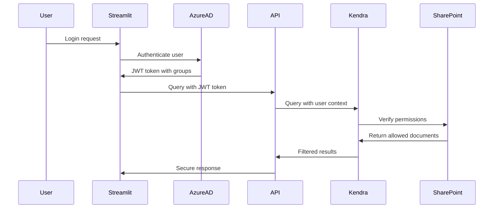

# SharePoint Integration with Kendra - ACL-Based Access Control Guide

This guide explains how to integrate SharePoint Online with Amazon Kendra for secure, ACL-based document access in your RAG pipeline.

## 🔐 How SharePoint ACL Integration Works

### SharePoint ACL Scanning Process

1. **Automatic ACL Discovery**: Kendra's SharePoint connector automatically scans SharePoint permissions during indexing
2. **Permission Mapping**: SharePoint users, groups, and permissions are mapped to Kendra's access control format
3. **Real-time Filtering**: When users query, Kendra filters results based on their actual SharePoint permissions
4. **Token-Based Authentication**: Uses JWT tokens to verify user identity and group membership

### ACL Data Structure

When Kendra indexes SharePoint content, it captures:

```json
{
  "document_id": "sharepoint_page_123",
  "content": "Page content here...",
  "acl": {
    "allowed_users": [
      "john.doe@company.com",
      "jane.smith@company.com"
    ],
    "allowed_groups": [
      "Finance Team",
      "Executives",
      "Project Managers"
    ],
    "denied_users": [],
    "denied_groups": []
  },
  "metadata": {
    "sharepoint_site": "https://company.sharepoint.com/sites/finance",
    "page_title": "Q4 Financial Report",
    "author": "john.doe@company.com",
    "created": "2024-01-15T10:30:00Z",
    "modified": "2024-01-20T14:45:00Z"
  }
}
```

## 🚀 Setup Instructions

### Step 1: Configure SharePoint Credentials

After deployment, update the SharePoint credentials in AWS Secrets Manager:

```bash
# Update SharePoint credentials
aws secretsmanager update-secret \
  --secret-id "kendra-sharepoint-credentials-[suffix]" \
  --secret-string '{
    "username": "your-service-account@company.com",
    "password": "your-service-account-password",
    "domain": "company.onmicrosoft.com"
  }'
```

### Step 2: Configure JWT Signing Key

Set up the JWT signing key for user token validation:

```bash
# Update JWT signing key (get this from your Azure AD app registration)
aws secretsmanager update-secret \
  --secret-id "kendra-jwt-signing-key-[suffix]" \
  --secret-string '{
    "key": "-----BEGIN CERTIFICATE-----\nMIIC...your-jwt-signing-key...\n-----END CERTIFICATE-----"
  }'
```

### Step 3: Update SharePoint URLs

Modify the SharePoint URLs in your Terraform configuration:

```hcl
# In main.tf, update the sharepoint_urls
sharepoint_urls = [
  "https://yourcompany.sharepoint.com/sites/finance",
  "https://yourcompany.sharepoint.com/sites/hr", 
  "https://yourcompany.sharepoint.com/sites/legal",
  "https://yourcompany.sharepoint.com/sites/projects"
]
```

### Step 4: Azure AD App Registration

Create an Azure AD application for JWT token generation:

1. **Register Application** in Azure AD
2. **Configure API Permissions**:
   - Microsoft Graph: `User.Read`
   - Microsoft Graph: `Group.Read.All`
   - SharePoint: `Sites.Read.All`
3. **Generate Client Secret**
4. **Configure Token Endpoint**

## 🔍 How ACL Filtering Works in Practice

### Scenario 1: User with Direct Access

```python
# User john.doe@company.com queries for financial data
query_request = {
    "query": "What are the Q4 revenue numbers?",
    "user_id": "john.doe@company.com",
    "user_groups": ["Finance Team", "Executives"],
    "sources": ["sharepoint"],
    "user_token": "eyJ0eXAiOiJKV1QiLCJhbGciOiJSUzI1NiIs..."
}

# Kendra automatically filters to only return documents where:
# - john.doe@company.com is in allowed_users, OR
# - "Finance Team" or "Executives" is in allowed_groups
```

### Scenario 2: User with Group-Based Access

```python
# User jane.smith@company.com (member of HR Team)
query_request = {
    "query": "What are the employee benefits?",
    "user_id": "jane.smith@company.com", 
    "user_groups": ["HR Team", "Managers"],
    "sources": ["sharepoint"],
    "user_token": "eyJ0eXAiOiJKV1QiLCJhbGciOiJSUzI1NiIs..."
}

# Only returns SharePoint pages where:
# - jane.smith@company.com has explicit access, OR
# - "HR Team" or "Managers" group has access
```

### Scenario 3: Hybrid Search (PDF + SharePoint)

```python
# Search both PDF documents and SharePoint content
query_request = {
    "query": "Show me all project documentation",
    "user_id": "project.manager@company.com",
    "user_groups": ["Project Managers", "Engineering"],
    "sources": ["bedrock", "sharepoint"],  # Search both sources
    "user_token": "eyJ0eXAiOiJKV1QiLCJhbGciOiJSUzI1NiIs..."
}

# Returns:
# - PDF documents from S3/Bedrock (filtered by metadata)
# - SharePoint pages (filtered by ACL)
# - Combined and ranked by relevance
```

## 🛡️ Security Architecture

### Multi-Layer Access Control

1. **Network Layer**: VPC-only API Gateway
2. **Authentication Layer**: AWS IAM + JWT tokens
3. **Authorization Layer**: SharePoint ACLs + Metadata filtering
4. **Application Layer**: User/group-based result filtering

### Token Flow



## 📊 Usage Examples

### Basic SharePoint Search

```python
import requests
import json
from your_auth_module import get_user_jwt_token

def search_sharepoint_content(query, user_id, user_groups):
    # Get JWT token for the user (from your Azure AD integration)
    jwt_token = get_user_jwt_token(user_id)
    
    api_url = "https://[api-id].execute-api.us-east-1.amazonaws.com/prod/query"
    
    payload = {
        "query": query,
        "user_id": user_id,
        "user_groups": user_groups,
        "sources": ["sharepoint"],  # Only search SharePoint
        "user_token": jwt_token,
        "type": "retrieve_and_generate",
        "use_caching": True
    }
    
    # Make signed request (AWS IAM)
    response = make_signed_request(api_url, payload)
    return response.json()

# Example usage
result = search_sharepoint_content(
    query="What are the latest HR policies?",
    user_id="employee@company.com",
    user_groups=["All Employees", "HR Team"]
)

print(f"Found {len(result['citations'])} relevant SharePoint pages")
for citation in result['citations']:
    for ref in citation['retrievedReferences']:
        sharepoint_url = ref['location']['sharepoint']['uri']
        title = ref['metadata']['title']
        print(f"- {title}: {sharepoint_url}")
```

### Hybrid Search (PDF + SharePoint)

```python
def search_all_content(query, user_id, user_groups):
    jwt_token = get_user_jwt_token(user_id)
    
    payload = {
        "query": query,
        "user_id": user_id,
        "user_groups": user_groups,
        "sources": ["bedrock", "sharepoint"],  # Search both sources
        "user_token": jwt_token,
        "type": "retrieve_and_generate",
        "use_caching": True
    }
    
    response = make_signed_request(api_url, payload)
    result = response.json()
    
    # Analyze source distribution
    bedrock_results = [r for r in result['citations'] if r.get('source') == 'bedrock']
    sharepoint_results = [r for r in result['citations'] if r.get('source') == 'sharepoint']
    
    print(f"Found {len(bedrock_results)} PDF documents and {len(sharepoint_results)} SharePoint pages")
    
    return result
```

## 🔧 Troubleshooting

### Common Issues

1. **No SharePoint Results Returned**
   - Check JWT token validity and user groups
   - Verify SharePoint connector sync status
   - Confirm user has actual SharePoint permissions

2. **Authentication Errors**
   - Validate JWT signing key in Secrets Manager
   - Check Azure AD app registration permissions
   - Verify token format and claims

3. **Sync Issues**
   - Monitor Kendra data source sync logs
   - Check SharePoint service account permissions
   - Verify network connectivity from VPC

### Monitoring Commands

```bash
# Check Kendra index status
aws kendra describe-index --index-id [kendra-index-id]

# Check data source sync status
aws kendra describe-data-source \
  --index-id [kendra-index-id] \
  --id [data-source-id]

# View sync history
aws kendra list-data-source-sync-jobs \
  --index-id [kendra-index-id] \
  --id [data-source-id]
```

## 💰 Cost Considerations

### Kendra Pricing
- **Developer Edition**: $810/month + query costs
- **Enterprise Edition**: $1,008/month + query costs
- **Document Storage**: $0.30 per 1,000 documents/month
- **Queries**: $0.85 per 1,000 queries

### Optimization Tips
- Use Developer Edition for testing/small deployments
- Implement query caching to reduce costs
- Monitor and optimize sync frequency
- Use incremental sync when possible

## 🚀 Next Steps

1. **Deploy Infrastructure**: Run `terraform apply`
2. **Configure Credentials**: Update Secrets Manager values
3. **Set Up Azure AD**: Create app registration and JWT keys
4. **Test Connectivity**: Verify SharePoint connector sync
5. **Implement Frontend**: Update Streamlit app for hybrid search
6. **Monitor Performance**: Set up CloudWatch dashboards

The SharePoint integration provides enterprise-grade access control while maintaining the security and performance benefits of your existing RAG pipeline!